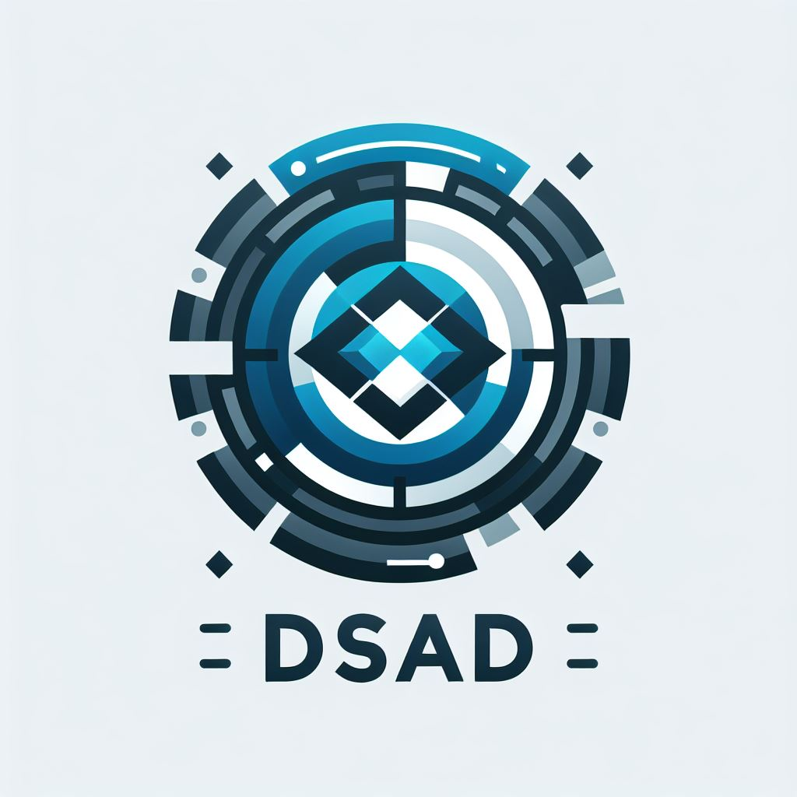

# DSAD - Deep Security Debug Logs Anonymizer



**DSAD provides ability to share Deep Security agent debug logs with altered ip addresses and domain names**

DSAD features include:
1. Unpack debug log ZIP file and process all files one by one.
2. Anonymize private ip addresses, given list of hostnames and subdomains of given domains list.
3. Text files (XML, JSON, CSV, logs, etc.) and SQLite database files are supported.
4. Codeword is used to encrypt all ip addresses and domain names in debug logs. Keeping the same codeword for subsequent debug logs within the same support case will preserve consistency of anonymized debug logs.
5. Create new debug ZIP file with anonymized debug logs.

## Usage

After generating debug using dsa_control -d command use dsad to anonymize debug logs.

## Command line parameters

**-i filename** - path to debug file.

**-c code** - code word to use for anonymization. For example: "1234567890". This codeword will be used to encrypt all ip addresses and domain names in debug logs. Keep the same codeword for subsequent debug logs share within the same support case.

**-d value** - provide company domain name to anonymize all subdomains. For example: "company.com". "host1" for host1.company.com will be anonymized. This option can be used multiple times.

**-h value** - provide hostnames to anonymize. For example: "host1" for host1.company.com will be anonymized. This option can be used multiple times.

## Example

After running dsa_contol -d on the endpoint named Pluto in the network with local domains tech.local  and office.local we get debug log file named 1736335478.zip. Anonymization command will look like this:
```commandline
dsad.exe -i 1736335478.zip -h pluto -i 1736335478.zip -c 123456 -d tech.local -d office.local
```

One can add more -h and -d options to anonymize more hostnames and domains.